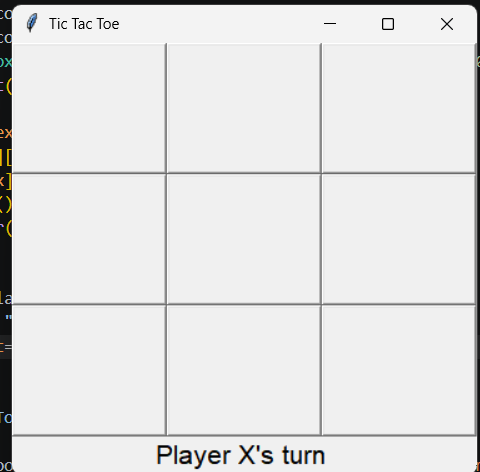
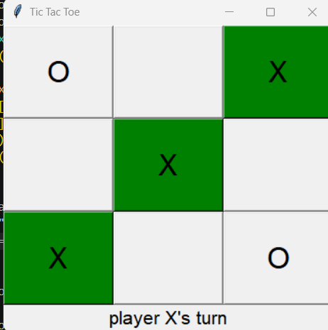
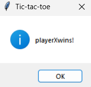

# TicTacToe

This project implements the classic two-player game where each player takes turns marking "X" or "O" on a 3x3 grid. 

Objective: 
Be the first to form a line of three marks horizontally, vertically, or diagonally.

Features:
3x3 interactive button grid.
Real-time turn tracking (X's turn vs O's turn).
Automatic win and tie detection.
Restart/Reset button to start a new game instantly.

Demo : 

